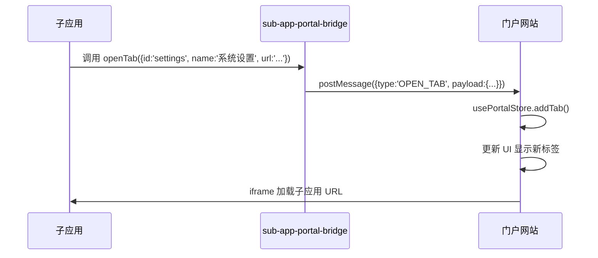
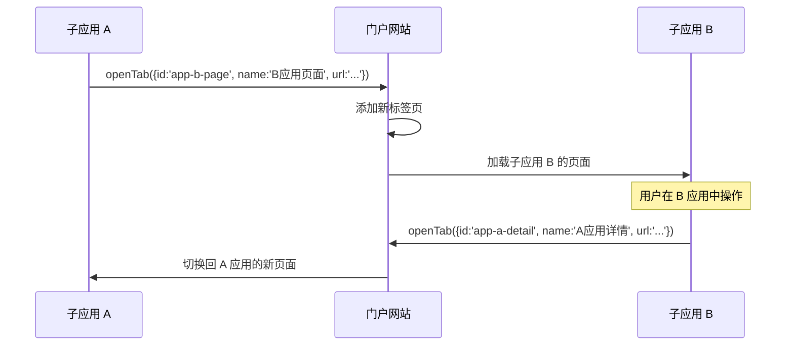
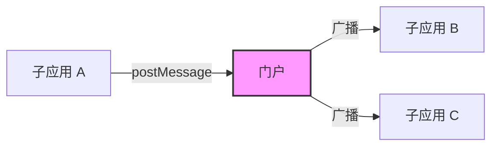

# 门户与子应用交互 - 打开设置 Tab 说明文档

## 概述

本文档详细说明了门户（Portal）与子应用之间如何通过消息机制交互来管理标签页（Tab）的打开、关闭和切换操作。

## 架构设计

### 整体架构

```
┌─────────────────────────────────────────────────────────┐
│                      门户 (Portal)                        │
│  ┌──────────────┐  ┌──────────────┐  ┌────────────────┐ │
│  │ PortalTabs   │  │ PortalContent│  │ usePortalMessage│ │
│  │ (标签栏组件)  │  │ (内容区域)    │  │ (消息监听Hook) │ │
│  └──────┬───────┘  └──────┬───────┘  └───────┬────────┘ │
│         │                 │                  │           │
│         ▼                 ▼                  ▼           │
│  ┌─────────────────────────────────────────────────────┐ │
│  │              usePortalStore (Zustand Store)          │ │
│  │  - tabs: TabItem[]        // 标签页数据               │ │
│  │  - activeTabId: string | null  // 当前激活的标签ID     │ │
│  └─────────────────────────────────────────────────────┘ │
└─────────────────────────────────────────────────────────┘
                          │
                          │ postMessage 通信
                          ▼
┌─────────────────────────────────────────────────────────┐
│                    子应用 (Sub App)                       │
│  ┌─────────────────────────────────────────────────────┐ │
│  │            sub-app-portal-bridge.ts                  │ │
│  │  - openTab()      // 打开新标签页                     │ │
│  │  - closeTab()     // 关闭标签页                       │ │
│  │  - setActiveTab() // 切换到指定标签页                  │ │
│  │  - getTabs()      // 获取所有标签页信息                │ │
│  │  - onPortalMessage() // 监听门户消息                   │ │
│  └─────────────────────────────────────────────────────┘ │
└─────────────────────────────────────────────────────────┘
```

## 核心文件说明

### 1. 子应用桥接层 ([sub-app-portal-bridge.ts](src/sub-app-portal-bridge.ts))

这是子应用与门户通信的核心模块，提供了一系列 API 供子应用调用。

#### 消息源标识符

```typescript
const PORTAL_MESSAGE_SOURCE = '__vite_portal__'
```

所有消息都包含此标识符，用于过滤非门户相关的消息。

#### 主要接口定义

```typescript
export interface OpenTabOptions {
  id: string       // 标签页唯一标识
  name: string     // 标签页显示名称
  url: string      // 子应用的 URL 地址
  closable?: boolean // 是否可关闭，默认为 true
}
```

#### 核心 API 函数

##### 1) openTab(options: OpenTabOptions)

**功能**：向门户发送打开新标签页的消息

**参数说明**：

- `id` (string): 标签页的唯一标识符，建议使用业务相关的 ID
- `name` (string): 标签页在门户标签栏中显示的名称
- `url` (string): 要加载的子应用 URL
- `closable` (boolean, 可选): 是否允许用户关闭此标签页，默认为 `true`

**使用示例**：

```typescript
import { openTab } from './sub-app-portal-bridge'

// 打开一个可关闭的设置页面
openTab({
  id: 'settings-general',
  name: '通用设置',
  url: 'https://subapp.example.com/settings/general',
  closable: true,
})

// 打开一个不可关闭的主页面
openTab({
  id: 'home',
  name: '首页',
  url: 'https://subapp.example.com/home',
  closable: false,
})
```

**实现原理**：

```typescript
export function openTab(options: OpenTabOptions) {
  window.parent.postMessage(
    {
      source: PORTAL_MESSAGE_SOURCE,
      type: 'OPEN_TAB',
      payload: {
        id: options.id,
        name: options.name,
        url: options.url,
        closable: options.closable ?? true,
      },
    },
    '*'  // 在生产环境中建议指定具体的 origin
  )
}
```

##### 2) closeTab(tabId: string)

**功能**：关闭指定的标签页

**参数说明**：

- `tabId` (string): 要关闭的标签页 ID

**使用示例**：

```typescript
import { closeTab } from './sub-app-portal-bridge'

// 关闭设置页面
closeTab('settings-general')
```

##### 3) setActiveTab(tabId: string)

**功能**：切换到指定的标签页（使其成为当前活动标签）

**参数说明**：

- `tabId` (string): 要激活的标签页 ID

**使用示例**：

```typescript
import { setActiveTab } from './sub-app-portal-bridge'

// 切换到设置页面
setActiveTab('settings-general')
```

##### 4) getTabs(): Promise<unknown[]>

**功能**：获取当前门户中所有标签页的信息

**返回值**：Promise，解析为标签页数组

**使用示例**：

```typescript
import { getTabs } from './sub-app-portal-bridge'

async function fetchAllTabs() {
  const tabs = await getTabs()
  console.log('当前所有标签页:', tabs)
  // 输出格式: [{ id, name, url, closable }, ...]
}
```

**注意**：此函数有 5 秒超时限制，如果门户未响应则返回空数组。

##### 5) onPortalMessage(callback)

**功能**：监听来自门户的消息

**参数说明**：

- `callback`: 回调函数，接收 `{ type, payload }` 参数

**返回值**：取消监听的函数（cleanup function）

**使用示例**：

```typescript
import { onPortalMessage } from './sub-app-portal-bridge'

const unsubscribe = onPortalMessage((data) => {
  console.log('收到门户消息:', data.type, data.payload)
  
  switch (data.type) {
    case 'TAB_ACTIVATED':
      console.log('标签被激活:', data.payload)
      break
    case 'TAB_CLOSED':
      console.log('标签被关闭:', data.payload)
      break
  }
})

// 组件卸载时取消监听
// useEffect(() => () => unsubscribe(), [])
```

---

### 2. 门户消息处理 ([use-portal-message.ts](src/hooks/use-portal-message.ts))

这是门户端的 React Hook，负责监听和处理来自子应用的消息。

#### 支持的消息类型

| 消息类型 | 说明 | Payload 结构 |
|---------|------|-------------|
| `OPEN_TAB` | 打开新标签页 | `{ id, name, url, closable? }` |
| `CLOSE_TAB` | 关闭标签页 | `{ id }` |
| `SET_ACTIVE_TAB` | 切换活动标签 | `{ id }` |
| `GET_TABS` | 请求所有标签页数据 | 无 |

#### 实现细节

```typescript
export const usePortalMessage = () => {
  const { addTab, removeTab, setActiveTab, tabs } = usePortalStore()

  useEffect(() => {
    const handleMessage = (event: MessageEvent) => {
      const data = event.data
      
      // 过滤非门户消息
      if (data?.source !== PORTAL_MESSAGE_SOURCE) return

      switch (data.type) {
        case 'OPEN_TAB':
          // 添加或激活标签页
          addTab({ ... })
          break
        case 'CLOSE_TAB':
          // 移除标签页
          removeTab(payload.id)
          break
        case 'SET_ACTIVE_TAB':
          // 设置当前活动标签
          setActiveTab(payload.id)
          break
        case 'GET_TABS':
          // 向所有 iframe 返回标签页数据
          // ...
          break
      }
    }

    window.addEventListener('message', handleMessage)
    return () => window.removeEventListener('message', handleMessage)
  }, [addTab, removeTab, setActiveTab, tabs])
}
```

---

### 3. 状态管理 ([store/portal.ts](src/store/portal.ts))

使用 Zustand 管理门户的全局状态，并通过 `persist` 中间件将标签页数据持久化到 localStorage。

#### 数据结构

```typescript
interface TabItem {
  id: string       // 唯一标识
  name: string     // 显示名称
  url: string      // 加载地址
  closable: boolean // 是否可关闭
}

interface PortalState {
  menuData: MenuItem[]       // 导航菜单数据
  tabs: TabItem[]            // 所有打开的标签页
  activeTabId: string | null // 当前活动的标签页 ID
  
  // 操作方法
  addTab: (item: TabItem) => void
  removeTab: (id: string) => void
  setActiveTab: (id: string) => void
  closeOtherTabs: (id: string) => void
  closeAllTabs: () => void
}
```

#### 关键行为

**addTab 逻辑**：

- 如果标签页已存在，只切换到该标签页（不重复添加）
- 如果标签页不存在，添加新标签页并将其设为活动标签

**removeTab 逻辑**：

- 不可关闭的标签页（`closable: false`）无法被移除
- 关闭当前活动标签时，自动切换到最后一个标签或第一个不可关闭的标签

**持久化配置**：

```typescript
persist(
  (set) => ({ /* state */ }),
  {
    name: 'portal-storage',
    partialize: (state) => ({
      tabs: state.tabs,
      activeTabId: state.activeTabId
    }),
  }
)
```

只有 `tabs` 和 `activeTabId` 会被持久化，菜单数据不会保存。

---

### 4. UI 组件

#### PortalTabs 组件 ([PortalTabs.tsx](src/components/PortalTabs.tsx))

**功能**：渲染标签页栏，提供标签切换、关闭、右键菜单等操作。

**特性**：

- 响应式设计：适配移动端、大屏、2K 屏等不同尺寸
- 右键菜单：支持"关闭当前"、"关闭其他"、"关闭全部"
- 自动隐藏关闭按钮：对于不可关闭的标签页不显示关闭图标

#### PortalContent 组件 ([PortalContent.tsx](src/components/PortalContent.tsx))

**功能**：通过 iframe 加载子应用内容。

**特性**：

- 使用绝对定位 + visibility 控制显示/隐藏（避免重复加载）
- 所有标签页同时加载，但只显示当前活动标签
- iframe 安全沙箱配置：`allow-same-origin allow-scripts allow-popups allow-forms`

---

## 使用流程

### 场景一：从子应用打开新的设置标签页



**代码示例**：

```typescript
// 在子应用的某个按钮点击事件中
function handleOpenSettings() {
  openTab({
    id: 'system-settings',
    name: '系统设置',
    url: `${window.location.origin}/settings`,
    closable: true,
  })
}
```

### 场景二：子应用间相互跳转



### 场景三：监听标签页变化

```typescript
// 在子应用中监听门户的标签页状态变化
useEffect(() => {
  const unsubscribe = onPortalMessage((data) => {
    if (data.type === 'TAB_ACTIVATED') {
      // 当前标签被激活时执行某些逻辑
      refreshData()
    }
  })
  
  return unsubscribe
}, [])
```

---

## 最佳实践

### 1. 标签页 ID 命名规范

建议使用具有业务语义的 ID 格式：

```typescript
// ✅ 推荐：使用有意义的命名
openTab({
  id: 'user-profile-settings',        // 功能模块-具体页面
  name: '个人资料设置',
  url: '/settings/profile'
})

openTab({
  id: 'order-detail-12345',           // 实体类型-唯一ID
  name: '订单详情 #12345',
  url: `/orders/12345`
})

// ❌ 不推荐：使用无意义的随机数
openTab({
  id: Math.random().toString(),
  name: '某个页面',
  url: '/some-page'
})
```

### 2. 处理重复打开

门户会自动处理重复打开的情况：

- 如果相同 ID 的标签页已存在，只会切换到该标签页，不会重复创建
- 这确保了同一业务页面只会打开一次

### 3. 安全性考虑

**生产环境建议**：

```typescript
// 开发环境使用 '*'
window.parent.postMessage(message, '*')

// 生产环境应该指定具体的 origin
const PORTAL_ORIGIN = 'https://portal.yourdomain.com'
window.parent.postMessage(message, PORTAL_ORIGIN)
```

### 4. 错误处理

```typescript
// 包装 openTab 函数以添加错误处理
async function safeOpenTab(options: OpenTabOptions) {
  try {
    openTab(options)
    
    // 可选：验证是否成功打开
    const tabs = await getTabs()
    const opened = tabs.some(tab => tab.id === options.id)
    
    if (!opened) {
      console.warn(`标签页 ${options.id} 可能未成功打开`)
    }
  } catch (error) {
    console.error('打开标签页失败:', error)
  }
}
```

### 5. 性能优化

- **避免频繁切换**：批量操作时先收集再一次性切换
- **懒加载**：对于大量标签页，考虑按需加载策略
- **内存管理**：及时关闭不需要的标签页释放资源

---

## 消息协议完整参考

### 消息格式

所有消息遵循统一格式：

```typescript
{
  source: '__vite_portal__',  // 固定值，用于识别门户消息
  type: string,               // 消息类型
  payload?: unknown           // 消息负载数据
}
```

### 消息类型枚举

| 类型常量 | 方向 | 说明 |
|---------|------|------|
| `OPEN_TAB` | 子应用 → 门户 | 打开新标签页 |
| `CLOSE_TAB` | 子应用 → 门户 | 关闭指定标签页 |
| `SET_ACTIVE_TAB` | 子应用 → 门户 | 切换活动标签页 |
| `GET_TABS` | 子应用 → 门户 | 请求所有标签页数据 |
| `TABS_DATA` | 门户 → 子应用 | 返回标签页数据响应 |

### Payload 定义

#### OpenTabPayload

```typescript
interface OpenTabPayload {
  id: string        // 必填，标签页唯一标识
  name: string      // 必填，显示名称
  url: string       // 必填，加载地址
  closable?: boolean // 可选，是否可关闭，默认 true
}
```

#### CloseTabPayload / SetActiveTabPayload

```typescript
interface CloseTabPayload {
  id: string  // 目标标签页 ID
}

interface SetActiveTabPayload {
  id: string  // 目标标签页 ID
}
```

#### TabsDataPayload

```typescript
interface TabsDataPayload extends Array<{
  id: string
  name: string
  url: string
  closable: boolean
}> {}
```

---

## 常见问题 FAQ

### Q1: 为什么我的标签页没有打开？

**可能原因**：

1. 子应用未正确嵌入到门户的 iframe 中
2. `postMessage` 的 targetOrigin 不匹配
3. 消息被浏览器安全策略拦截

**排查步骤**：

```javascript
// 在子应用控制台检查
console.log('parent window:', window.parent)

// 在门户控制台检查消息监听
window.addEventListener('message', (e) => console.log('Received:', e.data))
```

### Q2: 如何防止标签页被意外关闭？

**解决方案**：

```typescript
// 将 closable 设为 false
openTab({
  id: 'important-page',
  name: '重要页面',
  url: '/important',
  closable: false  // 不可关闭
})
```

### Q3: 标签页数据会丢失吗？

**答案**：不会。门户使用 Zustand 的 persist 中间件将标签页数据保存在 localStorage 中，刷新页面后会自动恢复。

**注意**：URL 必须是有效的且可访问的，否则 iframe 会加载失败。

### Q4: 可以在多个子应用间共享状态吗？

**可以**，但需要通过门户作为中介：



实现方式：

1. 子应用 A 发送自定义消息给门户
2. 门户接收后转发给其他所有 iframe
3. 其他子应用通过 `onPortalMessage` 监听并响应

### Q5: 如何调试消息通信？

**推荐工具**：

1. 浏览器 DevTools Console：查看 console.log 输出
2. Vue/React DevTools：检查组件状态
3. Chrome DevTools Application > Local Storage：查看持久化数据

**调试代码**：

```typescript
// 临时添加消息日志
const originalPostMessage = window.parent.postMessage.bind(window.parent)
window.parent.postMessage = function(data, origin) {
  console.log('[Debug] Sending message:', data)
  return originalPostMessage(data, origin)
}

// 监听所有消息
window.addEventListener('message', (event) => {
  console.log('[Debug] Received message:', event.data)
})
```

---

## 扩展开发

### 自定义消息类型

如果需要扩展新的消息类型：

**1. 在 portal-message.ts 中定义类型**：

```typescript
export interface CustomPayload {
  // 你的自定义字段
}

export type PortalMessageType =
  | { type: 'OPEN_TAB'; payload: OpenTabPayload }
  | { type: 'CUSTOM_ACTION'; payload: CustomPayload }  // 新增
  // ... 其他类型
```

**2. 在 use-portal-message.ts 中处理**：

```typescript
case 'CUSTOM_ACTION': {
  const payload = data.payload as CustomPayload
  // 处理你的自定义逻辑
  break
}
```

**3. 在 sub-app-portal-bridge.ts 中暴露方法**：

```typescript
export function sendCustomAction(payload: CustomPayload) {
  window.parent.postMessage(
    {
      source: PORTAL_MESSAGE_SOURCE,
      type: 'CUSTOM_ACTION',
      payload,
    },
    '*'
  )
}
```

---

## 总结

本门户系统提供了完整的标签页管理能力，通过 postMessage 机制实现了安全的跨域通信。核心优势包括：

✅ **解耦性**：子应用无需依赖门户的具体实现  
✅ **灵活性**：支持动态打开、关闭、切换标签页  
✅ **持久化**：标签页状态自动保存，刷新不丢失  
✅ **安全性**：基于浏览器原生 postMessage API  
✅ **可扩展**：易于添加自定义消息类型  

开发者只需引入 `sub-app-portal-bridge` 模块，即可轻松实现与门户的集成。

---

**文档版本**: v1.0  
**最后更新**: 2026-07-03  
**适用项目**: vite-portal 门户系统
